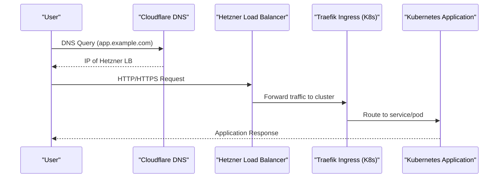

   
  
  <h1 style="margin-top: 0; padding-top: 0;">Terraform - Hcloud - Talos</h1>
  

---

k8s-for-poor-people is a Terraform module that provisions a minimal yet production-capable Kubernetes cluster on Hetzner Cloud. It leverages Talos, a modern, secure, and immutable Linux distribution built for Kubernetes. Designed with simplicity and cost-efficiency in mind, this project offers an easy way to bootstrap your own cluster without breaking the bank.

## Features

- [x] ARM and x86\_64 architecture support
- [x] Cilium CNI (default)
- [ ] Kube-router CNI - lightweight Cilium alternative (planned)
- [ ] IPv6 support
- [x] Traefik Gateway (Ingress + Service Mesh-ready)
- [ ] Cilium Gateway - native eBPF-powered ingress (planned)
- [x] HA control plane (1, 3, or 5 Talos-managed nodes)
- [x] Autoscaling worker nodes
- [x] Static worker node support (non-autoscaled)
- [x] Cloudflare integration (DNS, WAF, CDN)
- [x] Hetzner CSI (persistent block storage support)
- [x] Hetzner Load Balancer support
- [ ] Automatic Talos and Kubernetes upgrades (Not tested yet)
- [ ] Multi-region cluster support (planned)
- [ ] Grafana Cloud integration for centralized monitoring and alerting

---

## Architecture Overview

The following diagram illustrates the flow of a typical external request from DNS resolution to application response in a cluster provisioned by this module:

## Prerequisites

### Software Requirements

- [Terraform](https://www.terraform.io/downloads.html) (>= 1.8.0)
- [Hetzner CLI (`hcloud`)](https://github.com/hetznercloud/cli) (optional, for manual management)
- [Talosctl](https://www.talos.dev/v1.6/introduction/getting-started/#talosctl)
- [kubectl](https://kubernetes.io/docs/tasks/tools/install-kubectl/)
- [Helm](https://helm.sh/docs/intro/install/)

---

## Getting started

Go to the [example directory](./example) and follow instructions in `README.md`

---

## Known Limitations

- IPv6 dual-stack is not fully supported by Talos yet.
- Changes to `user_data` or Talos images require re-provisioning nodes.
- Some features like IPv6 or KubeSpan may require further testing.

---

## License

This project is licensed under the MIT License. See the [LICENSE](LICENSE) file for details.

# Terraform docs

<!-- BEGIN_TF_DOCS -->
## Requirements

| Name | Version |
|------|---------|
|  [terraform](#requirement\_terraform) | >=1.9.0 |
|  [hcloud](#requirement\_hcloud) | >= 1.63.0 |
|  [helm](#requirement\_helm) | >= 3.1.1 |
|  [http](#requirement\_http) | >= 3.6.0 |
|  [kubectl](#requirement\_kubectl) | >= 2.2.0 |
|  [kubernetes](#requirement\_kubernetes) | >= 3.1.0 |
|  [talos](#requirement\_talos) | >= 0.11.0 |
|  [tls](#requirement\_tls) | >= 4.3.0 |

## Providers

| Name | Version |
|------|---------|
|  [hcloud](#provider\_hcloud) | >= 1.63.0 |
|  [helm](#provider\_helm) | >= 3.1.1 |
|  [http](#provider\_http) | >= 3.6.0 |
|  [talos](#provider\_talos) | >= 0.11.0 |
|  [tls](#provider\_tls) | >= 4.3.0 |

## Modules

No modules.

## Resources

| Name | Type |
|------|------|
| [hcloud_firewall.this](https://registry.terraform.io/providers/hetznercloud/hcloud/latest/docs/resources/firewall) | resource |
| [hcloud_floating_ip.control_plane_ipv4](https://registry.terraform.io/providers/hetznercloud/hcloud/latest/docs/resources/floating_ip) | resource |
| [hcloud_floating_ip_assignment.this](https://registry.terraform.io/providers/hetznercloud/hcloud/latest/docs/resources/floating_ip_assignment) | resource |
| [hcloud_network.this](https://registry.terraform.io/providers/hetznercloud/hcloud/latest/docs/resources/network) | resource |
| [hcloud_network_subnet.nodes](https://registry.terraform.io/providers/hetznercloud/hcloud/latest/docs/resources/network_subnet) | resource |
| [hcloud_placement_group.control_plane](https://registry.terraform.io/providers/hetznercloud/hcloud/latest/docs/resources/placement_group) | resource |
| [hcloud_placement_group.worker](https://registry.terraform.io/providers/hetznercloud/hcloud/latest/docs/resources/placement_group) | resource |
| [hcloud_primary_ip.control_plane_ipv4](https://registry.terraform.io/providers/hetznercloud/hcloud/latest/docs/resources/primary_ip) | resource |
| [hcloud_primary_ip.control_plane_ipv6](https://registry.terraform.io/providers/hetznercloud/hcloud/latest/docs/resources/primary_ip) | resource |
| [hcloud_primary_ip.worker_ipv4](https://registry.terraform.io/providers/hetznercloud/hcloud/latest/docs/resources/primary_ip) | resource |
| [hcloud_primary_ip.worker_ipv6](https://registry.terraform.io/providers/hetznercloud/hcloud/latest/docs/resources/primary_ip) | resource |
| [hcloud_server.control_planes](https://registry.terraform.io/providers/hetznercloud/hcloud/latest/docs/resources/server) | resource |
| [hcloud_server.workers](https://registry.terraform.io/providers/hetznercloud/hcloud/latest/docs/resources/server) | resource |
| [hcloud_ssh_key.this](https://registry.terraform.io/providers/hetznercloud/hcloud/latest/docs/resources/ssh_key) | resource |
| [helm_release.autoscaler](https://registry.terraform.io/providers/hashicorp/helm/latest/docs/resources/release) | resource |
| [helm_release.cilium](https://registry.terraform.io/providers/hashicorp/helm/latest/docs/resources/release) | resource |
| [helm_release.hcloud_ccm](https://registry.terraform.io/providers/hashicorp/helm/latest/docs/resources/release) | resource |
| [helm_release.hcloud_csi](https://registry.terraform.io/providers/hashicorp/helm/latest/docs/resources/release) | resource |
| [helm_release.prometheus_operator_crds](https://registry.terraform.io/providers/hashicorp/helm/latest/docs/resources/release) | resource |
| [talos_cluster_kubeconfig.this](https://registry.terraform.io/providers/siderolabs/talos/latest/docs/resources/cluster_kubeconfig) | resource |
| [talos_machine_bootstrap.this](https://registry.terraform.io/providers/siderolabs/talos/latest/docs/resources/machine_bootstrap) | resource |
| [talos_machine_secrets.this](https://registry.terraform.io/providers/siderolabs/talos/latest/docs/resources/machine_secrets) | resource |
| [tls_private_key.ssh_key](https://registry.terraform.io/providers/hashicorp/tls/latest/docs/resources/private_key) | resource |
| [hcloud_datacenter.this](https://registry.terraform.io/providers/hetznercloud/hcloud/latest/docs/data-sources/datacenter) | data source |
| [hcloud_floating_ip.control_plane_ipv4](https://registry.terraform.io/providers/hetznercloud/hcloud/latest/docs/data-sources/floating_ip) | data source |
| [hcloud_image.arm](https://registry.terraform.io/providers/hetznercloud/hcloud/latest/docs/data-sources/image) | data source |
| [hcloud_image.x86](https://registry.terraform.io/providers/hetznercloud/hcloud/latest/docs/data-sources/image) | data source |
| [hcloud_location.this](https://registry.terraform.io/providers/hetznercloud/hcloud/latest/docs/data-sources/location) | data source |
| [http_http.talos_health](https://registry.terraform.io/providers/hashicorp/http/latest/docs/data-sources/http) | data source |
| [talos_client_configuration.this](https://registry.terraform.io/providers/siderolabs/talos/latest/docs/data-sources/client_configuration) | data source |
| [talos_machine_configuration.autoscaler](https://registry.terraform.io/providers/siderolabs/talos/latest/docs/data-sources/machine_configuration) | data source |
| [talos_machine_configuration.control_plane](https://registry.terraform.io/providers/siderolabs/talos/latest/docs/data-sources/machine_configuration) | data source |
| [talos_machine_configuration.worker](https://registry.terraform.io/providers/siderolabs/talos/latest/docs/data-sources/machine_configuration) | data source |

## Inputs

| Name | Description | Type | Default | Required |
|------|-------------|------|---------|:--------:|
|  [allow\_scheduling\_on\_control\_planes](#input\_allow\_scheduling\_on\_control\_planes) | If true, the control plane nodes will be allowed to schedule pods. | `bool` | `true` | no |
|  [autoscaler\_nodepools](#input\_autoscaler\_nodepools) | Workers definition. K8s autoscaler will be installed if this map has at least one entry | <pre>map(object({     server_type     = string     min_nodes       = number     max_nodes       = number     datacenter      = optional(string)     extra_user_data = optional(map(any))     labels          = optional(map(string), {})     taints = optional(list(object({       key    = string       value  = string       effect = string     })), [])   }))</pre> | `{}` | no |
|  [autoscaler\_version](#input\_autoscaler\_version) | Version of the autoscaler to use. Default is the latest version. | `string` | `null` | no |
|  [cilium](#input\_cilium) | Cilium configuration. Service Monitor requires monitoring.coreos.com/v1 CRDs. | <pre>object({     enabled                 = optional(bool, true)     version                 = optional(string, null)     values                  = optional(map(any))     enable_encryption       = optional(bool, false)     enable_service_monitors = optional(bool, false)   })</pre> | `{}` | no |
|  [cluster\_api\_host](#input\_cluster\_api\_host) | Optional. A stable DNS hostname for the public Kubernetes API endpoint (e.g., `kube.mydomain.com`).     If set, you MUST configure a DNS A record for this hostname pointing to your desired public entrypoint (e.g., Floating IP, Load Balancer IP).     This hostname will be embedded in the cluster's certificates (SANs).     If not set, the generated kubeconfig/talosconfig will use an IP address based on `output_mode_config_cluster_endpoint`.     Internal cluster communication often uses `kube.[cluster_domain]`, which is handled automatically via /etc/hosts if `enable_alias_ip = true`. | `string` | `null` | no |
|  [cluster\_domain](#input\_cluster\_domain) | The domain name of the cluster. | `string` | `"cluster.local"` | no |
|  [cluster\_name](#input\_cluster\_name) | The name of the cluster. | `string` | n/a | yes |
|  [cluster\_prefix](#input\_cluster\_prefix) | Prefix Hetzner Cloud resources with the cluster name. | `bool` | `false` | no |
|  [control\_planes](#input\_control\_planes) | Control plane definition. Total control\_planes count should be 1, 3 or 5 | <pre>map(object({     server_type     = string     datacenter      = optional(string)     labels          = optional(map(string), {})     count           = optional(number, 1)     ipv4_enabled    = optional(bool, true)     ipv6_enabled    = optional(bool, false)     extra_user_data = optional(map(any))   }))</pre> | `{}` | no |
|  [datacenter](#input\_datacenter) | The name of the datacenter where the cluster will be created.     This is used to determine the region and zone of the cluster and network.     Possible values: fsn1-dc14, nbg1-dc3, hel1-dc2, ash-dc1, hil-dc1 | `string` | n/a | yes |
|  [deploy\_prometheus\_operator\_crds](#input\_deploy\_prometheus\_operator\_crds) | If true, the Prometheus Operator CRDs will be deployed. | `bool` | `false` | no |
|  [disable\_arm](#input\_disable\_arm) | If true, arm images will not be used. | `bool` | `false` | no |
|  [disable\_talos\_coredns](#input\_disable\_talos\_coredns) | If true, the CoreDNS delivered by Talos will not be deployed. | `bool` | `false` | no |
|  [disable\_x86](#input\_disable\_x86) | If true, x86 images will not be used. | `bool` | `false` | no |
|  [enable\_alias\_ip](#input\_enable\_alias\_ip) | If true, a private alias IP (defaulting to the .100 address within `node_ipv4_cidr`) will be configured on the control plane nodes.     This enables a stable internal IP for the Kubernetes API server, reachable via `kube.[cluster_domain]`.     The module automatically configures `/etc/hosts` on nodes to resolve `kube.[cluster_domain]` to this alias IP. | `bool` | `true` | no |
|  [enable\_floating\_ip](#input\_enable\_floating\_ip) | If true, a floating IP will be created and assigned to the control plane nodes. | `bool` | `false` | no |
|  [enable\_ipv6](#input\_enable\_ipv6) | If true, the servers will have an IPv6 address.     IPv4/IPv6 dual-stack is actually not supported, it keeps being an IPv4 single stack. PRs welcome! | `bool` | `false` | no |
|  [enable\_kube\_span](#input\_enable\_kube\_span) | If true, the KubeSpan Feature (with "Kubernetes registry" mode) will be enabled. | `bool` | `false` | no |
|  [extraManifests](#input\_extraManifests) | Additional manifests URL applied during Talos bootstrap. | `list(string)` | `null` | no |
|  [extra\_firewall\_rules](#input\_extra\_firewall\_rules) | Additional firewall rules to apply to the cluster. | `list(any)` | `[]` | no |
|  [firewall\_kube\_api\_source](#input\_firewall\_kube\_api\_source) | Source networks that have Kube API access to the servers.     If null (default), the all traffic is blocked. | `list(string)` | `null` | no |
|  [firewall\_talos\_api\_source](#input\_firewall\_talos\_api\_source) | Source networks that have Talos API access to the servers.     If null (default), the all traffic is blocked. | `list(string)` | `null` | no |
|  [floating\_ip](#input\_floating\_ip) | The Floating IP (ID) to use for the control plane nodes.     If `null` (default), a new floating IP will be created.     (using object because of https://github.com/hashicorp/terraform/issues/26755) | <pre>object({     id = number,   })</pre> | `null` | no |
|  [hcloud\_ccm](#input\_hcloud\_ccm) | Hetzner Cloud Controller Manager | <pre>object({     enabled   = optional(bool, true)     version   = optional(string, null)     values    = optional(map(any))     namespace = optional(string, "kube-system")   })</pre> | `{}` | no |
|  [hcloud\_csi](#input\_hcloud\_csi) | Hetzner Cloud CSI | <pre>object({     enabled   = optional(bool, true)     version   = optional(string, null)     values    = optional(map(any))     namespace = optional(string, "kube-system")   })</pre> | `{}` | no |
|  [hcloud\_token](#input\_hcloud\_token) | The Hetzner Cloud API token. | `string` | n/a | yes |
|  [kernel\_modules\_to\_load](#input\_kernel\_modules\_to\_load) | List of kernel modules to load. | <pre>list(object({     name       = string     parameters = optional(list(string))   }))</pre> | `null` | no |
|  [kube\_api\_extra\_args](#input\_kube\_api\_extra\_args) | Additional arguments to pass to the kube-apiserver. | `map(string)` | `{}` | no |
|  [kubelet\_extra\_args](#input\_kubelet\_extra\_args) | Additional arguments to pass to kubelet. | `map(string)` | `{}` | no |
|  [kubernetes\_version](#input\_kubernetes\_version) | The Kubernetes version to use. If not set, the latest version supported by Talos is used: https://www.talos.dev/v1.13/introduction/support-matrix/     Needs to be compatible with the `cilium_version`: https://docs.cilium.io/en/stable/network/kubernetes/compatibility/ | `string` | `"1.36.0"` | no |
|  [network\_ipv4\_cidr](#input\_network\_ipv4\_cidr) | The main network cidr that all subnets will be created upon. | `string` | `"10.0.0.0/16"` | no |
|  [node\_ipv4\_cidr](#input\_node\_ipv4\_cidr) | Node CIDR, used for the nodes (control plane and worker nodes) in the cluster. | `string` | `"10.0.1.0/24"` | no |
|  [output\_mode\_config\_cluster\_endpoint](#input\_output\_mode\_config\_cluster\_endpoint) | Configure which endpoint address is written into the generated `talosconfig` and `kubeconfig` files.     - `public_ip`: Use the public IP of the first control plane (or the Floating IP if enabled).     - `private_ip`: Use the private IP of the first control plane (or the private Alias IP if enabled). Useful if accessing only via VPN/private network.     - `cluster_endpoint`: Use the hostname defined in `cluster_api_host`. Requires `cluster_api_host` to be set. | `string` | `"public_ip"` | no |
|  [pod\_ipv4\_cidr](#input\_pod\_ipv4\_cidr) | Pod CIDR, used for the pods in the cluster. | `string` | `"10.0.16.0/20"` | no |
|  [registries](#input\_registries) | List of registry mirrors to use.     Example:<pre>hcl     registries = {       mirrors = {         "docker.io" = {           endpoints = [             "http://localhost:5000",             "https://docker.io"           ]         }       }       config = {         "docker.io" = {           auth = {             username = ""             password = ""           }         }       }     }</pre>See: https://www.talos.dev/v1.6/reference/configuration/v1alpha1/config/#Config.machine.registries | <pre>object({     mirrors = optional(map(object({       endpoints    = list(string)       overridePath = optional(bool)     })))     config = optional(map(object({       auth = object({         username      = optional(string)         password      = optional(string)         auth          = optional(string)         identityToken = optional(string)       })     })))   })</pre> | `null` | no |
|  [service\_ipv4\_cidr](#input\_service\_ipv4\_cidr) | Service CIDR, used for the services in the cluster. | `string` | `"10.0.8.0/21"` | no |
|  [ssh\_public\_key](#input\_ssh\_public\_key) | The public key to be set in the servers. It is not used in any way.     If you don't set it, a dummy key will be generated and used.     Unfortunately, it is still required, otherwise the Hetzner will sen E-Mails with login credentials. | `string` | `null` | no |
|  [sysctls\_extra\_args](#input\_sysctls\_extra\_args) | Additional sysctls to set. | `map(string)` | `{}` | no |
|  [talos\_version](#input\_talos\_version) | The version of talos features to use in generated machine configurations. | `string` | n/a | yes |
|  [workers](#input\_workers) | Workers definition | <pre>map(object({     server_type     = string     datacenter      = optional(string)     labels          = optional(map(string), {})     count           = optional(number, 1)     ipv4_enabled    = optional(bool, true)     ipv6_enabled    = optional(bool, false)     extra_user_data = optional(map(any))   }))</pre> | `{}` | no |

## Outputs

| Name | Description |
|------|-------------|
|  [hetzner\_network\_id](#output\_hetzner\_network\_id) | Network ID of the network created at cluster creation |
|  [kubeconfig](#output\_kubeconfig) | n/a |
|  [kubeconfig\_data](#output\_kubeconfig\_data) | Structured kubeconfig data to supply to other providers |
|  [public\_ipv4\_list](#output\_public\_ipv4\_list) | List of public IPv4 addresses of all control plane nodes |
|  [talos\_client\_configuration](#output\_talos\_client\_configuration) | n/a |
|  [talos\_machine\_configurations\_control\_plane](#output\_talos\_machine\_configurations\_control\_plane) | n/a |
|  [talos\_machine\_configurations\_worker](#output\_talos\_machine\_configurations\_worker) | n/a |
|  [talos\_worker\_ids](#output\_talos\_worker\_ids) | Server IDs of the hetzner talos workers machines |
|  [talosconfig](#output\_talosconfig) | n/a |
<!-- END_TF_DOCS -->
